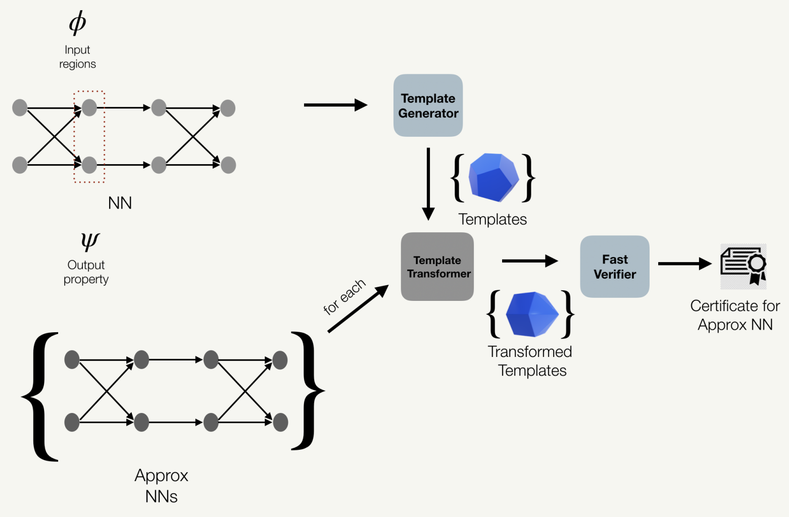

Proof Transfer
--------------------



This tool provides a technique for faster certification of Neural Networks (NNs) using proof transfer. Various approximations such as quantization, pruning, perforation, sampling, etc; are now widely used to speed up network inference. Post-training approximations change the weights of networks, and hence the original proof of certification of the network becomes invalid. Similarly, fine-tuning a neural network for repairing or other reasons, networks need to be verified again. Certification of network robustness is a computationally expensive task. Hence, in this paper, we try to accelerate the certification proof of approximate or fine-tuned networks by transfer some information during the certification proof of the original network.

Installation instruction
--------------------
1. Install ERAN (https://github.com/eth-sri/eran) 
2. Install other Python libraries
```
pip install -r /path/to/requirements.txt
```

Running experiments
--------------------
Example:
```
python3 proof_transfer.py --config approx_config.yml --attack patch  --netname nets/fconv4_cifar.onnx --anetname nets/fconv4_cifar_quant16.onnx --iterations 1
```

* Possible attacks:
```
1. patch
2. l0_random
3. l0_center
4. rotation
5. brightness
```
* netname: it is the name of the original network. 
* anetname: it is the name of the approximate network.
* dataset: dataset name is extracted from the yml config file based on the network name. 


Example Config
--------------------
An example config is provided in `approx_config.json` file. 

Following are the configs used for the results in the paper

FCONV2 (MNIST)
```
strategy:
      - type: 3
        layer: [3, 4]
template:
  length: 14
  width: 28
least_count: 0.005
template_search: 'ms'
lc1: 0.25
lc: 0.25
```


